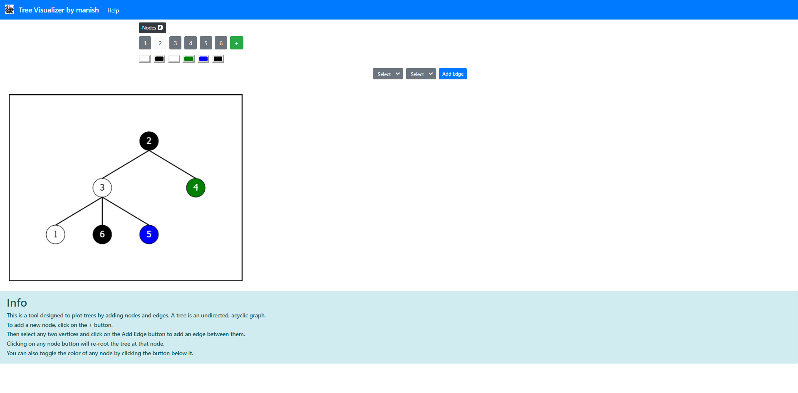

# tree-visualizer
Plot trees by adding nodes and edges with re-rooting at any node and customizable colours. Try it [here!](https://tree-visualizer.vercel.app/)

# Screenshot



# Info

This project has been made using **ReactJS**. To get started, you can clone this repository, install the necessary dependencies and run:

```npm start```
